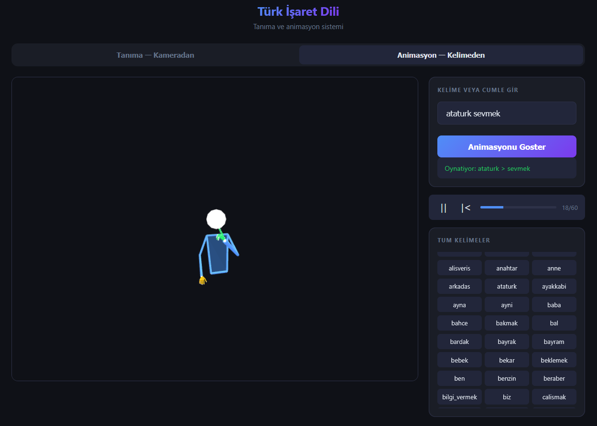
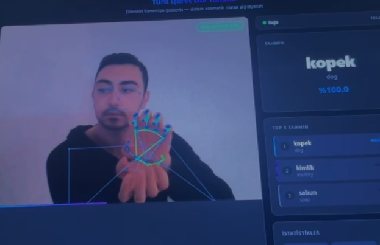
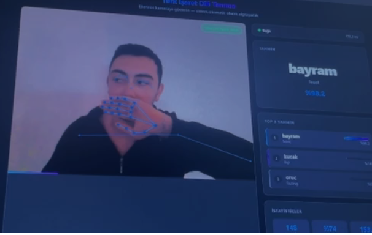
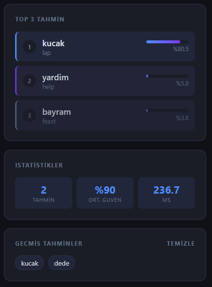
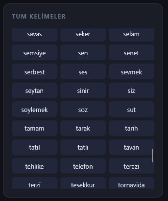

# 🤟 Turkish Sign Language — Recognition & Animation

<p align="center">
  
</p>

<p align="center">
  <b>Real-time Turkish Sign Language recognition from webcam + text-to-sign 3D animation</b>
</p>

<p align="center">
  
  
  
  
  
  
</p>

---

## Overview

This project consists of two complementary systems for Turkish Sign Language (TİD):

- **Recognition** — Webcam input → real-time sign prediction using a BiLSTM model
- **Animation** — Text input → 3D stick figure performs the sign(s)

Both systems run in the browser with a FastAPI backend. No GPU required.

---

## Demo

### Sign Recognition

<p align="center">
  
  
</p>

MediaPipe Holistic runs entirely in the browser and extracts hand + pose landmarks in real time. The landmark vectors are streamed to the backend via WebSocket, where the BiLSTM model performs inference.

<p align="center">
  
</p>

Top-3 predictions are shown with confidence bars, along with session statistics (total predictions, average confidence, latency) and prediction history.

---

### Sign Animation

<p align="center">
  
  
</p>

Type any word or sentence — the stick figure performs each sign sequentially with smooth transitions between words. 226 signs available, extracted from the AUTSL dataset using MediaPipe.

---

## Model Performance

Trained on **184 classes** (42 low-accuracy classes removed from the original 226):

| Metric | Score |
|--------|-------|
| Top-1 Accuracy | **76.14%** |
| Top-3 Accuracy | **89.28%** |
| Top-5 Accuracy | **91.88%** |

Evaluation is performed on a cross-subject validation split — training and validation sets contain entirely different signers, reflecting real-world performance.

---

## Architecture

```
Browser                          FastAPI Backend
───────────────────────────      ────────────────────────
Webcam → MediaPipe Holistic  →   WebSocket → BiLSTM Model → Top-3 Predictions
(landmark extraction, WASM)      (TensorFlow inference)

Text Input → fetch /landmark →   JSON landmark frames
Three.js stick figure render
```

**Model:** Bidirectional LSTM + Dense head
**Input:** 16 frames × 252 features (color + depth landmarks, both hands)
**Landmark extraction:** MediaPipe Hands (21 keypoints × 2 hands × 3 coords)

---

## Dataset

[AUTSL](https://cvml.ankara.edu.tr/datasets/) — Ankara University Turkish Sign Language Dataset

| Property | Value |
|----------|-------|
| Classes | 226 words |
| Total videos | ~38,000 |
| Format | RGB + Depth, 512×512, 30fps |
| Signers | 43 (cross-subject split) |
| Train signers | 31 |
| Validation signers | 6 |

---

## Project Structure

```
├── backend.py                  # FastAPI — WebSocket, ML inference, landmark API
├── index.html                  # Frontend — recognition UI + 3D animation viewer
├── extract_landmarks.py        # Extracts MediaPipe landmarks from AUTSL videos
├── model_assets/
│   ├── model.keras             # Trained BiLSTM (not included — see below)
│   ├── label_map.json          # Class ID → TR/EN word mapping
│   ├── norm_stats.json         # Normalization mean/std
│   ├── demo_config.json        # Model configuration
│   └── label_encoder_classes.npy
└── dataset/
    ├── landmarks/              # 226 × 30-frame landmark JSON files
    ├── SignList_ClassId_TR_EN.csv
    ├── train_labels.csv
    └── validation_labels.csv
```

---

## Setup

### Requirements

```bash
pip install fastapi uvicorn tensorflow mediapipe opencv-python numpy pandas
```

### 1. Download the model

The trained model (`model.keras`) is not included in this repository due to file size.  
Download it from Google Drive and place it in `model_assets/`.

> Link: *(add your Google Drive link here)*

### 2. (Optional) Re-extract landmarks

If you have the AUTSL dataset and want to re-extract landmarks:

```bash
python extract_landmarks.py --dataset "path/to/dataset"
```

This saves one JSON per word into `dataset/landmarks/`. Takes ~12 minutes on a standard CPU.

### 3. Run

```bash
python backend.py
```

Open [http://localhost:8000](http://localhost:8000)

---

## Usage

**Recognition tab**
1. Allow camera access
2. Show a sign — system collects 16 frames then predicts
3. Top-3 results shown with confidence scores

**Animation tab**
1. Type a word (e.g. `merhaba`) or sentence (e.g. `merhaba tesekkur`)
2. Click **Animasyonu Göster** or press Enter
3. Stick figure performs the sign(s) in sequence
4. Use the word grid to browse all 226 available signs

---

## Tech Stack

| Component | Technology |
|-----------|------------|
| Backend | FastAPI + Uvicorn |
| ML Model | TensorFlow / Keras |
| Landmark extraction (training) | MediaPipe (Python) |
| Landmark extraction (live) | MediaPipe Holistic (WASM, browser) |
| 3D Animation | Three.js |
| Communication | WebSocket |

---

## Notes

- Depth camera is not required — depth stream is set to zero for webcam demos
- Animation uses real landmark data extracted from AUTSL videos, not synthesized motion
- Word names in the animation system use ASCII-normalized labels (ç→c, ş→s, ğ→g, etc.)
